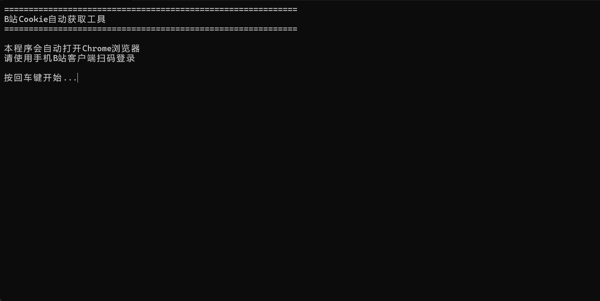
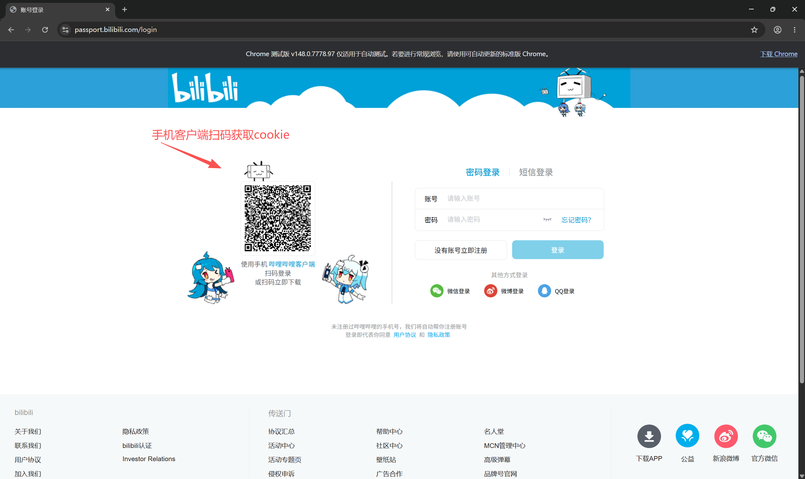
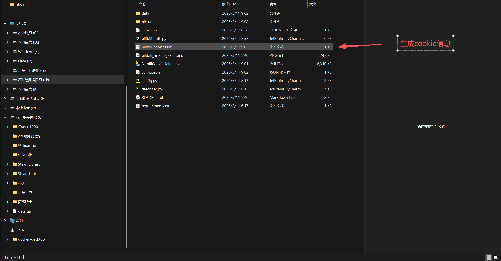

# Bilibili Cookie Helper

手机扫码方式获取B站Cookie - 自动通过浏览器扫码登录获取B站Cookie
有现成exe打包文件可以方便快速使用

## 功能特点

- 自动打开Chrome浏览器
- 扫码登录，无需手动输入
- 自动提取并保存Cookie(SESSDATA、bili_jct、DedeUserID)
- 显示Cookie内容，方便确认
- Cookie自动保存到本地文件（同目录下）

## 使用方法

### 方法一：直接使用EXE（推荐）

1. 下载 `BilibiliCookieHelper.exe`
2. 双击运行
3. 按回车键开始

    

4. 用手机B站扫码登录

    

5. 登录成功后按回车键退出，Cookie会自动保存到当前目录

    

### 方法二：源码运行

```bash
pip install selenium
python bilibili_auth.py
```

## 前置要求

- Chrome浏览器已安装
- ChromeDriver会自动匹配（Selenium 4.6+版本）

## 依赖

- selenium >= 4.6.0

## 项目结构

```
BilibiliCookieTool/
├── picture/                   # 截图说明
│   ├── 步骤一.png
│   ├── 步骤二.png
│   └── 步骤三.png
├── bilibili_auth.py          # 主程序
├── config.json               # 配置文件
├── requirements.txt          # Python依赖
├── BilibiliCookieHelper.exe  # 打包好的可执行文件
├── .gitignore
└── README.md
```

## Cookie说明

登录成功后会自动保存Cookie到：

- `bilibili_cookies.txt` - 记事本格式（同目录下）
- `data/cookies.json` - 原始JSON格式
- `config.json` - 完整Cookie字符串格式

## 常见问题

**Q: 提示"找不到Chrome浏览器"？**
A: 请确保Chrome已正确安装，Selenium会自动查找系统中的Chrome。

**Q: 超时怎么办？**
A: 重新运行程序即可，扫码有时间限制(3分钟)。

**Q: Cookie保存到哪里了？**
A: Cookie文件会保存到EXE所在目录下的 `bilibili_cookies.txt`

**Q: 如何验证Cookie是否有效？**
A: 使用获取的Cookie访问B站API进行验证。
